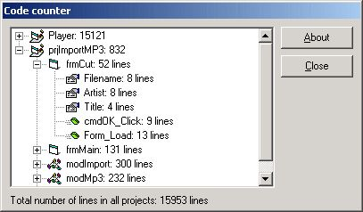



## CodeCounter Add\-In

### Description

This Add-In counts all the lines of code in your project(group).
 
### More Info
 

             |
---                |---
**Submitted On**   |2004-07-08 11:01:02
**By**             |[WouterL](https://github.com/Planet-Source-Code/PSCIndex/blob/master/ByAuthor/wouterl.md)
**Level**          |Intermediate
**User Rating**    |5.0 (15 globes from 3 users)
**Compatibility**  |VB 6\.0
**Category**       |[VB function enhancement](https://github.com/Planet-Source-Code/PSCIndex/blob/master/ByCategory/vb-function-enhancement__1-25.md)
**World**          |[Visual Basic](https://github.com/Planet-Source-Code/PSCIndex/blob/master/ByWorld/visual-basic.md)
**Archive File**   |[CodeCounte176740782004\.zip](https://github.com/Planet-Source-Code/wouterl-codecounter-add-in__1-54822/archive/master.zip)

